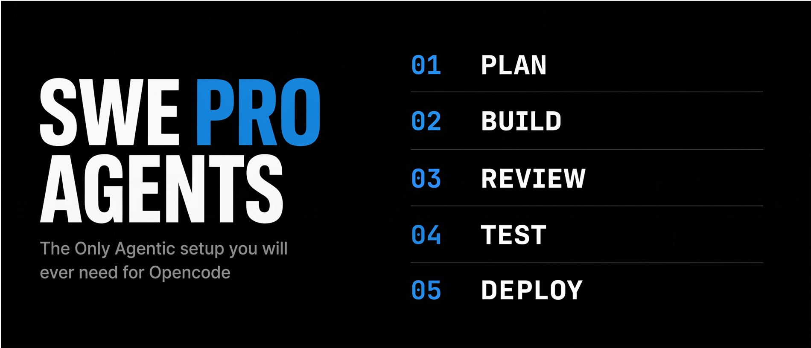

# SWE Pro Agents

<!-- markdownlint-disable MD033 -->

<div align="center">



[](https://www.npmjs.com/package/swe-pro-agents)
[](https://www.npmjs.com/package/swe-pro-agents)
[](https://github.com/beast-ofcourse/SWE-pro-Agents/actions)
[](LICENSE)
[](#agents)
[](#skills)

**26 OpenCode agent profiles (23 subagents + 3 primary) + 5 skills — a full engineering team in your terminal.**

</div>

---

## Table of Contents

- [Why This Exists](#why-this-exists)
- [What You Get](#what-you-get)
- [Install](#install)
- [Quick Start](#quick-start)
- [CLI Reference](#cli-reference)
- [Agents](#agents)
- [Skills](#skills)
- [Workflows](#workflows)
- [Updating](#updating)
- [Uninstalling](#uninstalling)
- [Development](#development)
- [Contributing](#contributing)
- [License](#license)

---

## Why This Exists

Most AI coding assistants start blank. No domain expertise, no engineering discipline, no architectural judgment — just a raw model and your prompt. Every session is ground zero.

SWE Pro Agents fixes that. Each agent is a **loaded expert** — a complete system prompt with tool permissions, behavioral rules, and error-handling conventions baked in. You don't ask a model to "review this PR"; you invoke `swe-reviewer`, an agent that already knows how to assess blast radius, flag security issues, and enforce your team's standards.

---

## What You Get

- **26 specialized agent profiles** — 23 subagents plus 3 primary agents (`swe-pro`, `architect`, `swe-reviewer`), each with a focused role, a curated prompt, and explicit tool permissions (read-only roles get deny-lists, implementers get scoped allow-lists).
- **5 on-demand skills** — token-compression mode, a skill-authoring suite, an adaptive tutoring loop, a repo-evidence-driven README generator, and an SVG hero generator; loadable from any agent via OpenCode's skill tool.
- **A manifest-based installer** — records exactly what it installs, prunes stale agents/skills from older versions on update, and never guesses ownership.
- **A safe uninstaller** — removes only files the pack owns; your own skills and merged config are never touched.
- **A status/setup CLI** — checks installation state, shows the config snippet, writes it with a backup, and checks for updates (offline-safe).
- **Zero runtime dependencies** — Node ≥ 18, plain stdlib. Nothing to install besides the package itself.

---

## Install

```bash
npm install -g swe-pro-agents
```

The postinstall hook copies:

- all 26 agent profiles to `~/.config/opencode/agents/swe-pro-agents/`,
- all 5 skills to `~/.config/opencode/skills/`,
- this pack's `AGENTS.md` to `~/.config/opencode/agents/swe-pro-agents/AGENTS.md`.

That last file matters: every agent in `agents/` is intentionally short because it assumes `AGENTS.md`'s Constitution, Definition of Done, and Handoff protocol are already loaded into context. If you don't already have a global `~/.config/opencode/AGENTS.md`, copy the installed one into place:

```bash
cp ~/.config/opencode/agents/swe-pro-agents/AGENTS.md ~/.config/opencode/AGENTS.md
```

If you already have one, merge in whatever sections you want — the installer never overwrites a global `AGENTS.md` automatically, on purpose. `swe-pro-agents status` tells you which state you're in.

> **Windows users:** paths are the same under `%USERPROFILE%` (`C:\Users\you\.config\opencode\...`), and `cp` becomes `Copy-Item`. The installer itself is cross-platform — it derives everything from your home directory, and CI runs the full test suite on Windows.

Then register the agents with OpenCode by adding to your `opencode.json`:

```json
{
  "agents": [{ "path": "~/.config/opencode/agents/swe-pro-agents" }]
}
```

Or let the CLI do it — it backs up your config first, then adds the entry:

```bash
swe-pro-agents setup --apply
```

**That's it.** Restart OpenCode and your entire agent team is ready.

The installer keeps a manifest at `~/.config/swe-pro-agents/manifest.json` recording exactly what it installed. On every install or update it prunes previously installed agents and skills the pack no longer ships — so upgrading never leaves stale files behind — and on uninstall it removes only what the pack owns, never your own skills.

---

## Quick Start

```bash
# Check your installation
swe-pro-agents status

# See the config snippet (if you skipped the step above)
swe-pro-agents setup
```

`status` prints the package version, agent/skill counts, whether `opencode.json` references the pack, whether the shared `AGENTS.md` is in place, and warns when a newer version exists on npm (the check is skipped silently when offline).

Once installed, invoke any agent from within OpenCode:

```text
@swe-pro         Plan and implement a rate limiter middleware
@swe-database    Design the schema for a multi-tenant SaaS app
@swe-reviewer    Review the last commit for security issues
@architect       Evaluate a migration to event-driven architecture
```

---

## CLI Reference

`bin/swe-pro-agents.js` — the only shipped executable:

| Command               | What it does                                                                 |
| --------------------- | ---------------------------------------------------------------------------- |
| `setup`               | Prints the `opencode.json` snippet and checks your global `AGENTS.md` state   |
| `setup --apply`       | Writes the `opencode.json` entry (backs up the existing config to `.bak` first) |
| `status`              | Shows installation state + npm update check (5s timeout, offline-safe)       |
| `version`             | Prints the package version                                                    |
| `help`                | Shows usage                                                                   |

---

## Agents

The team is organized into three squads. Each agent has a focused role, explicit tool permissions, and a curated system prompt optimized for that specific job.

<a name="swe-agents"></a>

### 🛠️ SWE Agents — Engineering Core

| Agent                | Role                                                                            |
| -------------------- | ------------------------------------------------------------------------------- |
| `swe-api`            | API contract design + implementation, request/response validation, versioning   |
| `swe-backend`        | Server-side logic, services, background jobs, integrations                      |
| `swe-database`       | Data modeling, schema design, migrations, query optimization, indexing          |
| `swe-debugger`       | Root-cause analysis through reproduction, then minimal correct fix              |
| `swe-desktop`        | Desktop apps — windowing, OS APIs, native packaging                             |
| `swe-devops`         | CI/CD pipelines, containers, infrastructure-as-code                             |
| `swe-documentation`  | READMEs, docstrings, API references, developer guides                           |
| `swe-frontend`       | Components, views, styling, state, animation, client interaction                |
| `swe-fullstack`      | End-to-end features keeping frontend and backend in sync                        |
| `swe-git`            | Branch management, commit hygiene, rebase, PR preparation                       |
| `swe-implementation` | General-purpose implementation (incl. CLI tools) for well-defined tasks         |
| `swe-mobile`         | Mobile screens, navigation, platform APIs, on-device perf                       |
| `swe-performance`    | Profiling, memory optimization, latency reduction — measured, not guessed       |
| `swe-pro`            | Senior engineer — planning, architecture decisions, code review, mentoring      |
| `swe-refactor`       | Restructuring code for clarity and maintainability without behavior change      |
| `swe-release`        | Versioning, changelogs, licensing, contribution readiness, publishing           |
| `swe-repository`     | Mapping unfamiliar codebases — structure, conventions, build commands           |
| `swe-reviewer`       | Read-only code review — correctness, risk, standards enforcement                |
| `swe-security`       | Vulnerability auditing, threat modeling, unsafe pattern detection               |

<a name="research-agents"></a>

### 🔬 Research Agents

| Agent            | Role                                          |
| ---------------- | --------------------------------------------- |
| `web-researcher` | Real-time web research for current information |

<a name="architecture-agents"></a>

### 🏗️ Architecture Agents

| Agent                      | Role                                                                  |
| -------------------------- | --------------------------------------------------------------------- |
| `architect`                | System design — trade-offs, constraints, decisions                    |
| `arch-design`              | System and feature architecture, RFC/ADR authoring                    |
| `arch-distributed-systems` | Consistency, partitioning, consensus, failure modes                   |
| `arch-migration`           | Incremental migration planning with rollback strategies               |
| `arch-scalability`         | Load analysis, bottleneck identification, scaling strategy            |
| `arch-strategy`            | Architecture assessment, technical-debt catalog, roadmap, build-vs-buy |

Three of the 26 profiles are **primary** agents (selectable as your main agent): `swe-pro`, `architect`, and `swe-reviewer`. The rest are subagents, invoked from a primary agent or by name.

---

## Skills

Beyond agents, SWE Pro Agents ships **5 skills** — a token-compression mode, a skill-authoring suite, an adaptive tutoring loop, a professional README generator, and an SVG hero generator. Each is a self-contained `SKILL.md` loaded on demand via OpenCode's `skill` tool:

| Skill               | Purpose                                                    |
| ------------------- | ---------------------------------------------------------- |
| `caveman`           | Ultra-compressed mode, cuts output tokens ~65%             |
| `skill-creator`     | Design, write, and improve skills — craft principles + draft/test/iterate workflow |
| `teach-me`          | Adaptive tutor — explain, quiz, exercise, track mastery over time |
| `readme-generator`  | Professional READMEs — create, audit, upgrade from repo evidence |
| `svg-hero-generator`| Repo-aware SVG hero banners — 3–4 concepts, then final SVG |

Skills auto-install to `~/.config/opencode/skills/` and are picked up by OpenCode automatically — no config needed.

<a name="agents-vs-skills"></a>

### Agents vs. skills

Agents are the team; skills are utilities. Invoke an agent directly (`@swe-frontend`, `@swe-backend`, …) when you know exactly which specialist you want and just need it to do that one job. Agents are lean by design: they assume this pack's `AGENTS.md` is already loaded into context (OpenCode does this automatically), and they only state what's specific to their domain — everything else (the Constitution, Definition of Done, Handoff protocol) lives in `AGENTS.md` once, not repeated 26 times. Their behavior depends on `AGENTS.md` being installed — see [Install](#install) if `swe-pro-agents status` reports it as missing.

The five skills are standalone utilities any agent can load on demand — `caveman` for ultra-compressed replies, `skill-creator` for authoring skills with rigor, `teach-me` for adaptive tutoring with persistent progress tracking, `readme-generator` and `svg-hero-generator` for repo-aware document artifacts. They are deliberately self-contained rather than depending on `AGENTS.md`, because a skill can be invoked by any agent in any project — including ones that don't have this pack's `AGENTS.md` installed at all.

If you're not sure which to reach for: a single, well-scoped implementation task with a clear owner → an agent. A communication-mode or document-artifact need → the matching skill. Don't run both for the same task — that's redundant effort, not extra rigor.

---

## Workflows

These agents are designed to **chain together**. Here are real workflows:

### Feature Delivery

```text
swe-pro → swe-implementation → swe-reviewer
```

Plan and implement, write tests, get reviewed. No context lost between steps.

### Bug Investigation

```text
swe-debugger → swe-security → swe-refactor
```

Find the root cause, check for similar vulnerabilities, clean up the code.

### Architecture Change

```text
architect → arch-migration → swe-database → swe-fullstack
```

Design the new architecture, plan the migration, update the schema, wire the full stack.

### Production Incident

```text
swe-debugger → swe-performance → swe-devops
```

Diagnose the issue, profile the bottleneck, deploy the fix.

---

## Updating

Agents are actively improved — new roles added, prompts refined, permissions tuned.

```bash
npm update -g swe-pro-agents
```

The installer prunes agents and skills from older versions automatically (via the manifest), so nothing stale lingers in your config after an update. `swe-pro-agents status` shows what changed and warns when a newer version is available.

---

## Uninstalling

```bash
npm uninstall -g swe-pro-agents
```

The preuninstall hook removes everything this pack installed: the agent files, the pack's skills (`caveman`, `skill-creator`, `teach-me`, `readme-generator`, `svg-hero-generator`), and its manifest. Your own skills in `~/.config/opencode/skills/` are never touched.

Two things remain, by design — they're your content:

- The `opencode.json` entry referencing the agents path — delete it manually
- Any AGENTS.md sections you merged into your global config — edit manually

---

## Development

Plain Node.js (≥ 18), zero dependencies. There is no build step — the tests are the entry point:

```bash
# Run the installer lifecycle suite (6 tests, zero deps)
npm test

# Equivalent, without npm
node test/installer.test.js
```

The tests simulate install/update/uninstall against a **throwaway `HOME`/`USERPROFILE` directory**, so your real `~/.config/opencode` is never touched. Note that a plain `npm install` in this repo triggers the `postinstall` hook — run tests directly (as CI does) if you don't want the installer to run against your real config.

CI (`.github/workflows/ci.yml`) runs syntax checks (`node --check`) and the test suite on **Linux + Windows × Node 18/20/22**.

```text
SWE-pro-Agents/
├── agents/       26 agent profiles (3 primary, 23 subagents)
├── skills/       5 skills: caveman, skill-creator, teach-me, readme-generator, svg-hero-generator
├── scripts/      install.js (postinstall), uninstall.js (preuninstall)
├── bin/          swe-pro-agents CLI
├── test/         installer lifecycle tests
├── .github/      CI workflow
├── AGENTS.md     shared foundation every agent assumes is loaded
└── package.json
```

---

## Contributing

Bug reports, feature requests, and PRs go through the [GitHub repository](https://github.com/beast-ofcourse/SWE-pro-Agents) — the [issues page](https://github.com/beast-ofcourse/SWE-pro-Agents/issues) is the place to start. The main thing to keep in mind: every agent file is short *because* it assumes the shared `AGENTS.md` foundation — keep new agents lean and put cross-cutting rules in `AGENTS.md`, not in each prompt.

---

## License

MIT — use it, fork it, ship it. See [LICENSE](LICENSE).
