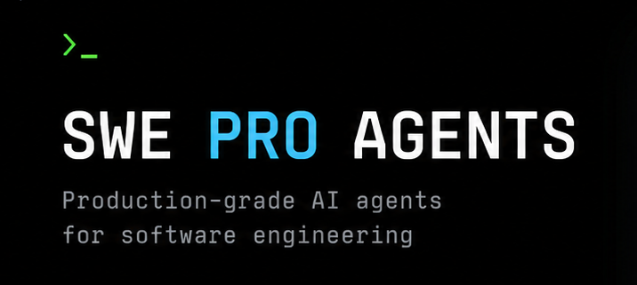

# SWE Pro Agents

<!-- markdownlint-disable MD033 -->

<div align="center">



[](https://www.npmjs.com/package/swe-pro-agents)
[](https://www.npmjs.com/package/swe-pro-agents)
[](LICENSE)
[](#agents)
[](#skills)

**27 production-grade OpenCode subagent profiles + 3 skills — deploy a full engineering team in your terminal.**

</div>

---

## Table of Contents

- [Why This Exists](#why-this-exists)
- [Install](#install)
- [Quick Start](#quick-start)
- [Agents](#agents)
  - [SWE Agents — Engineering Core](#swe-agents)
- [Research Agents](#research-agents)
- [Architecture Agents](#architecture-agents)
- [Skills](#skills)
  - [Agents vs. skills](#agents-vs-skills)
- [Workflows](#workflows)
  - [Feature Delivery](#feature-delivery)
  - [Bug Investigation](#bug-investigation)
  - [Architecture Change](#architecture-change)
  - [Production Incident](#production-incident)
- [Updating](#updating)
- [Agent Philosophy](#agent-philosophy)
- [License](#license)

---

## Why This Exists

Most AI coding assistants start blank. No domain expertise, no engineering discipline, no architectural judgment — just a raw model and your prompt. Every session is ground zero.

SWE Pro Agents fixes that. Each agent is a **loaded expert** — a complete system prompt with tool permissions, behavioral rules, error handling patterns, and engineering conventions baked in. You don't ask a model to "review this PR." You invoke `swe-reviewer` — an agent that already knows how to assess blast radius, flag security issues, and enforce your team's standards.

What you get:

- **Consistency** — every agent produces disciplined output, not random good intentions
- **Depth** — agents carry domain knowledge that would take paragraphs to prompt each time
- **Team structure** — 27 specialized roles that divide and conquer, not one monolithic chat

---

## Install

```bash
npm install -g swe-pro-agents
```

This copies all 27 agent profiles to `~/.config/opencode/agents/swe-pro-agents/`,
all 3 skills to `~/.config/opencode/skills/`, and this pack's `AGENTS.md` to
`~/.config/opencode/agents/swe-pro-agents/AGENTS.md`.

That last file matters: every agent in `agents/` is intentionally short because
it assumes `AGENTS.md`'s Constitution, Definition of Done, and Handoff protocol
are already loaded into context. If you don't already have a global
`~/.config/opencode/AGENTS.md`, copy the installed one into place:

```bash
cp ~/.config/opencode/agents/swe-pro-agents/AGENTS.md ~/.config/opencode/AGENTS.md
```

If you already have one, merge in whatever sections you want rather than
overwriting your existing rules — the installer never does this for you
automatically, on purpose. `swe-pro-agents status` tells you which state
you're in.

Then register the agents with OpenCode by adding to your `opencode.json`:

```json
{
  "agents": [{ "path": "~/.config/opencode/agents/swe-pro-agents" }]
}
```

**That's it.** Restart OpenCode and your entire agent team is ready.

---

## Quick Start

```bash
# Check your installation
swe-pro-agents status

# See the config snippet (if you skipped the step above)
swe-pro-agents setup
```

Once installed, invoke any agent from within OpenCode:

```text
@ swe-pro   Plan and implement a rate limiter middleware
@ swe-database  Design the schema for a multi-tenant SaaS app
@ swe-reviewer   Review the last commit for security issues
```

---

## Agents

The team is organized into three squads. Each agent has a focused role, explicit tool permissions, and a curated system prompt optimized for that specific job.

<a name="swe-agents"></a>

### 🛠️ SWE Agents — Engineering Core

| Agent                | Role                                                                            |
| -------------------- | ------------------------------------------------------------------------------- |
| `swe-api`            | API contract design + implementation, request/response validation, versioning   |
| `swe-backend`        | Server-side logic, services, background jobs, integrations                      |
| `swe-database`       | Data modeling, schema design, migrations, query optimization, indexing          |
| `swe-debugger`       | Root-cause analysis through reproduction, then minimal correct fix              |
| `swe-desktop`        | Desktop apps — windowing, OS APIs, native packaging                             |
| `swe-devops`         | CI/CD pipelines, containers, infrastructure-as-code                             |
| `swe-documentation`  | READMEs, docstrings, API references, developer guides                           |
| `swe-frontend`       | Components, views, styling, state, animation, client interaction                |
| `swe-fullstack`      | End-to-end features keeping frontend and backend in sync                        |
| `swe-git`            | Branch management, commit hygiene, rebase, PR preparation                       |
| `swe-implementation` | General-purpose implementation (incl. CLI tools) for well-defined tasks         |
| `swe-mobile`         | Mobile screens, navigation, platform APIs, on-device perf                       |
| `swe-performance`    | Profiling, memory optimization, latency reduction — measured, not guessed       |
| `swe-pro`            | Senior engineer — planning, architecture decisions, code review, mentoring      |
| `swe-refactor`       | Restructuring code for clarity and maintainability without behavior change      |
| `swe-release`        | Versioning, changelogs, licensing, contribution readiness, publishing           |
| `swe-repository`     | Mapping unfamiliar codebases — structure, conventions, build commands           |
| `swe-reviewer`       | Read-only code review — correctness, risk, standards enforcement                |
| `swe-security`       | Vulnerability auditing, threat modeling, unsafe pattern detection               |
| `swe-testing`        | Unit, integration, and e2e tests — coverage analysis, flakiness detection       |

<a name="research-agents"></a>

### 🔬 Research Agents

| Agent            | Role                                          |
| ---------------- | --------------------------------------------- |
| `web-researcher` | Real-time web research for current information |

<a name="architecture-agents"></a>

### 🏗️ Architecture Agents

| Agent                      | Role                                                                  |
| -------------------------- | --------------------------------------------------------------------- |
| `architect`                | System design — trade-offs, constraints, decisions                    |
| `arch-design`              | System and feature architecture, RFC/ADR authoring                    |
| `arch-distributed-systems` | Consistency, partitioning, consensus, failure modes                   |
| `arch-migration`           | Incremental migration planning with rollback strategies               |
| `arch-scalability`         | Load analysis, bottleneck identification, scaling strategy            |
| `arch-strategy`            | Architecture assessment, technical-debt catalog, roadmap, build-vs-buy |

---

## Skills

Beyond agents, SWE Pro Agents ships **3 skills** — a token-compression mode, a professional README generator, and an SVG hero generator, each loadable on demand via OpenCode's `skill` tool. Each skill is a focused `SKILL.md` with its own instructions:

Skills auto-install to `~/.config/opencode/skills/` and are picked up by OpenCode automatically — no config needed. Just start working and OpenCode's skill tool offers `caveman`, `readme-generator`, and `svg-hero-generator` when relevant.

| Skill               | Purpose                                                    |
| ------------------- | ---------------------------------------------------------- |
| `caveman`           | Ultra-compressed mode, cuts output tokens ~65%             |
| `readme-generator`  | Professional READMEs — create, audit, upgrade from repo evidence |
| `svg-hero-generator`| Repo-aware SVG hero banners — 3–4 concepts, then final SVG |

<a name="agents-vs-skills"></a>

### Agents vs. skills

Agents are the team; skills are utilities. Invoke an agent directly
(`@swe-frontend`, `@swe-backend`, …) when you know exactly which specialist you
want and just need it to do that one job. Agents are lean by design: they assume
this repo's root `AGENTS.md` is already loaded into context (OpenCode does this
automatically), and they only state what's specific to their domain — everything
else (the Constitution, Definition of Done, Handoff protocol) lives in
`AGENTS.md` once, not repeated 27 times. Their behavior depends on `AGENTS.md`
being installed — see [Install](#install) if `swe-pro-agents status` reports it
as missing.

The three skills are standalone utilities any agent can load on demand —
`caveman` for ultra-compressed replies, `readme-generator` and
`svg-hero-generator` for repo-aware document artifacts. They are deliberately
self-contained rather than depending on `AGENTS.md`, because a skill can be
invoked by any agent in any project — including ones that don't have this pack's
`AGENTS.md` installed at all.

If you're not sure which to reach for: a single, well-scoped implementation
task with a clear owner → an agent. A communication-mode or document-artifact
need → the matching skill. Don't run both for the same task — that's redundant
effort, not extra rigor.

---

## Workflows

These agents are designed to **chain together**. Here are real workflows:

### Feature Delivery

```text
swe-pro → swe-implementation → swe-testing → swe-reviewer
```

Plan and implement, write tests, get reviewed. No context lost between steps.

### Bug Investigation

```text
swe-debugger → swe-security → swe-refactor
```

Find the root cause, check for similar vulnerabilities, clean up the code.

### Architecture Change

```text
architect → arch-migration → swe-database → swe-fullstack
```

Design the new architecture, plan the migration, update the schema, wire the full stack.

### Production Incident

```text
swe-debugger → swe-performance → swe-devops
```

Diagnose the issue, profile the bottleneck, deploy the fix.

---

## Updating

Agents are actively improved — new roles added, prompts refined, permissions tuned.

```bash
npm update -g swe-pro-agents
```

Check what changed:

```bash
swe-pro-agents status
```

---

## Agent Philosophy

Every agent in this collection follows a set of engineering principles:

1. **Read before you write.** Never assume file contents or API contracts — verify first.
2. **Small, verifiable steps.** Make a change, confirm it, move on.
3. **Match existing conventions.** A new pattern needs a stated reason, not a preference.
4. **Minimize blast radius.** The smallest change that correctly solves the task.
5. **Errors are first-class.** Happy-path-only isn't finished.
6. **Leave it better.** No dead code, no debug leftovers, no unexplained TODOs.
7. **Say what you did and why.** Clear communication, not padding.

These aren't suggestions. They're baked into every agent prompt.

---

## License

MIT — use it, fork it, ship it.
